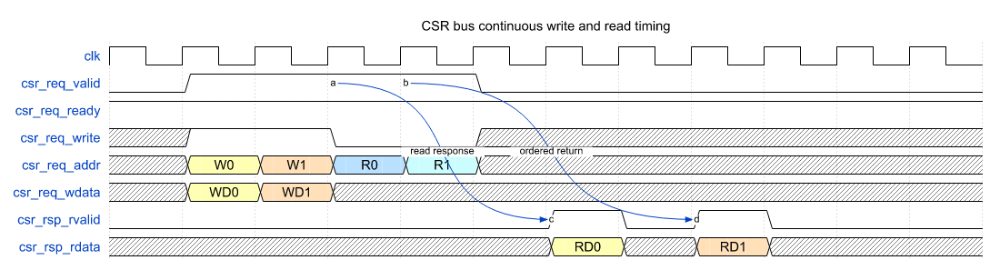
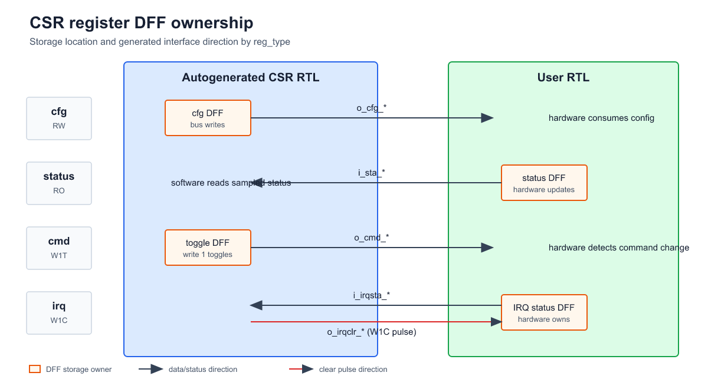
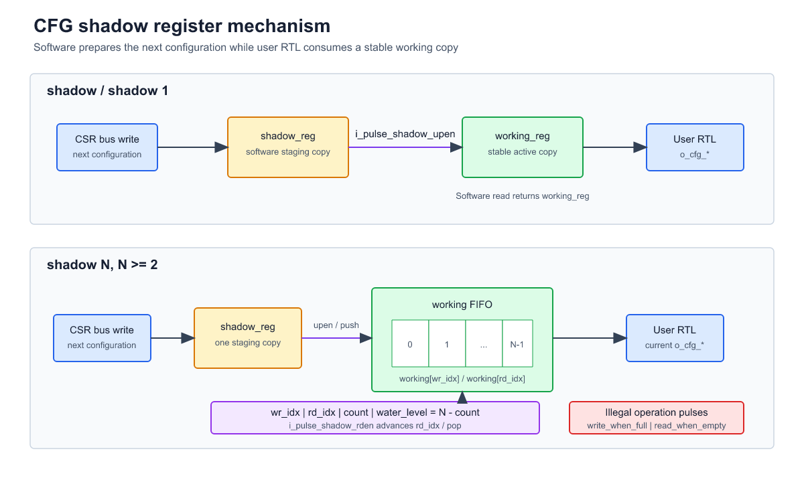

# CSR Autogen Tool

CSR Autogen Tool 是一款轻量级寄存器自动化生成工具。它解析 Markdown 或 Excel 寄存器定义，生成文档、SystemVerilog RTL、自检 Testbench、UVM RAL 模型以及 Firmware C Header。

## 1. 工具概览

主要能力：

- 支持 `.md`、`.xlsx` 两种输入格式。
- 支持单模块生成和多层级寄存器树展开。
- 自动检查地址重叠、字段重叠、位宽、访问属性和保留关键字。
- 生成 Markdown、HTML 和 Excel 寄存器文档。
- 生成 CSR RTL、typedef、struct wrapper 和集成模板。
- 生成自检 Testbench、UVM RAL 和 Firmware C Header。
- 自动计算 nested 模式下的绝对地址和全局 Address Map。

章节导航：

| 章节 | 内容                                  |
| :--- | :------------------------------------ |
| 2    | 安装、快速运行和格式转换              |
| 3    | 输入表格、寄存器类型和校验规则        |
| 4    | single/nested 两种生成模式            |
| 5    | `out/` 下各类生成文件                 |
| 6    | RTL 集成说明                          |
| 7    | 常见问题与当前限制                    |
| 8    | 内部模型、代码模块和二次开发          |

## 2. 安装与快速开始

### 2.1 环境与依赖

要求 Python 3。建议在工具目录下安装依赖：

```bash
python -m pip install -r requirements.txt
```

`jinja2` 用于生成 HTML，`openpyxl` 用于读取和生成 Excel。未安装 `jinja2` 时，Markdown、RTL 和 TB 仍可生成，但 HTML 输出会被跳过；未安装 `openpyxl` 时，Excel 输入不可解析，Excel 输出会被跳过。

查看命令行参数：

```bash
python src/autogen_reg.py --help
```

### 2.2 最小示例

生成单个模块：

```bash
python src/autogen_reg.py -i input/leaf_a1_reg.md -o out
```

从顶层递归生成完整寄存器树：

```bash
python src/autogen_reg.py -i input/top_reg.md --nested -o out
```

### 2.3 输入格式转换

将 `input/*.md` 转换为 Excel：

```bash
python input/xlsx/convert_md2xlsx.py
python src/autogen_reg.py -i input/xlsx/top_reg.xlsx --nested -o out
```

## 3. 输入定义规范

推荐使用 Markdown。纯文本便于评审、差异比较和版本控制；Excel 适合表格编辑，也适合非开发人员维护寄存器表。

### 3.1 base_info

输入文件包含 `base_info` 和 `reg_define` 两部分。常用基础配置如下：

| 配置                | 说明                      |
| :------------------ | :------------------------ |
| `reg_bitwidth`      | CSR 数据宽度，默认 32     |
| `system_baseaddr`   | 根模块系统基地址          |
| `system_bytesize`   | 根模块地址空间大小        |
| `system_prefix`     | Firmware 绝对地址宏前缀   |
| `author`、`email`   | 文档元信息                |

### 3.2 reg_define

寄存器表包含以下列：

| 列名              | 说明                                      |
| :---------------- | :---------------------------------------- |
| `offset`          | 模块内相对地址；留空时自动推导            |
| `reg_name`        | 寄存器、slave 或 mem 名称                 |
| `field`           | 字段名称                                  |
| `msb`、`lsb`      | 字段位范围                                |
| `SW_access`       | 软件访问属性                              |
| `default_value`   | 字段默认值                                |
| `reg_type`        | 寄存器类型                                |
| `special`         | repeat、shadow、bytesize 或子模块文件     |
| `description`     | 寄存器或字段说明                          |

一个寄存器有多个字段时，后续字段行可以留空 `offset` 和 `reg_name`。同一模块中重复的 `reg_name` 会按出现顺序自动添加编号。

#### 3.2.1 reg_type 与 SW_access

| reg_type        | SW_access | DFF 所在位置 | 用途                         |
| :-------------- | :-------- | :----------- | :--------------------------- |
| `cfg`           | `RW`      | autogen RTL  | 软件配置、硬件读取           |
| `status`        | `RO`      | user RTL     | 硬件状态、软件读取           |
| `cmd`/`toggle`  | `W1T`     | autogen RTL  | 写 1 翻转命令状态            |
| `irq`           | `W1C`     | user RTL     | 读取中断状态并产生清除脉冲   |
| `slave`         | 留空      | 子模块       | 引用下一级寄存器定义         |
| `mem`           | 留空      | 外部存储     | 保留连续地址区间             |

`toggle` 输入会在内部归一化为 `cmd`。

#### 3.2.2 special 属性

多个属性使用逗号分隔：

- `slv_filename=xxx.md`：`slave` 引用的子模块定义文件。
- `bytesize=0x...`：`slave` 或 `mem` 占用的地址空间。
- `repeat N`：连续生成 N 个寄存器实例。
- `shadow` / `shadow 1`：一份 shadow 和一份 working 配置。
- `shadow N`：一份 shadow 和 N 份 FIFO working 配置。

`repeat N` 的 `default_value` 支持 CSV。若默认值数量少于 N，后续实例沿用最后一个值。例如 `repeat 4` 配合 `0x12,12` 会展开为 `[0]=0x12, [1]=12, [2]=12, [3]=12`。

### 3.3 输入检查

工具会拒绝以下输入：

- offset 未按 CSR word bytes 对齐。
- 寄存器、slave 或 mem 地址范围发生重叠。
- 子模块实际地址空间超过父模块分配的 `bytesize`。
- 字段超出 `reg_bitwidth` 或同一寄存器内字段重叠。
- `reg_type` 与 `SW_access` 不匹配。
- `special` 用于不支持的寄存器类型。
- nested 引用形成递归环。
- 模块、寄存器或字段名称命中 Python、C、SystemVerilog 或 VHDL 保留关键字。

## 4. 生成模式

### 4.1 single 模式

single 是默认模式，只解析指定文件：

```bash
python src/autogen_reg.py -i input/leaf_a2_reg.md -o out
```

适合单模块开发、局部验证和回灌生成的 `*_gen.md`/`*_gen.xlsx`。寄存器 offset 保持模块内相对地址，不递归加载 `slv_filename`。

### 4.2 nested 模式

nested 从顶层文件开始，递归解析每个 `slave` 的 `slv_filename`：

```bash
python src/autogen_reg.py -i input/top_reg.md --nested -o out
```

该模式会：

- 按 `system_baseaddr` 和每层 slave offset 计算绝对地址。
- 为每一级 block 生成 Address Map。
- 检查父子地址空间和 sibling 区域是否冲突。
- 为每个唯一 source block 生成 RTL、TB 和 RAL。
- 允许同一 source block 在树中实例化多次。
- 对重复 block 实例使用 `_u1`、`_u2` 等唯一名称展示文档和 Firmware 地址。

## 5. 输出文件说明

默认输出目录为 `out/`。

### 5.1 文档 `out/doc/`

single 模式：

| 文件                 | 内容                         |
| :------------------- | :--------------------------- |
| `<block>_gen.md`     | 格式化后的单模块定义         |
| `<block>_gen.xlsx`   | 单模块 Excel 文档            |

nested 模式还会生成：

| 文件                | 内容                                  |
| :------------------ | :------------------------------------ |
| `<top>_tree.md`     | 全局 Address Map 和各 block 寄存器    |
| `<top>_tree.html`   | 带折叠侧边导航的完整网页              |
| `<top>_tree.xlsx`   | 带 sheet 导航和绝对地址的工作簿       |

### 5.2 RTL `out/rtl/`

```text
out/rtl/<block>.sv
out/rtl/plus/<block>_typedef.sv
out/rtl/plus/<block>_wrap.sv
out/rtl/plus/tmp_<block>.sv
```

- `<block>.sv`：展开 field 端口的主 CSR RTL。
- `<block>_typedef.sv`：cfg/status/cmd/irq packed struct 类型。
- `<block>_wrap.sv`：使用 struct 聚合寄存器端口的 wrapper。
- `tmp_<block>.sv`：主模块和 wrapper 的集成提示模板。

### 5.3 验证 `out/tb/`（TBD）

验证组件输出暂未人工复查过，当前仅作为自动生成内容保留。

| 文件                   | 内容                      |
| :--------------------- | :------------------------ |
| `<block>_tb.sv`        | 基础读写自检 Testbench    |
| `<block>_ral_pkg.sv`   | UVM RAL package           |

### 5.4 Firmware `out/firmware/`

Firmware Header 仅在 nested 模式生成：

| 文件                            | 内容                                                                       |
| :------------------------------ | :------------------------------------------------------------------------- |
| `<top>_all_reg_addr.h`          | block base/size/end、register offset/default、绝对地址和实例 default 宏    |
| `<top>_all_reg_type.h`          | 寄存器 union/struct 类型和 default 初始化函数                              |
| `c_legacy/<top>_field_macros.h` | C 兼容 field shift/mask/get/set 宏                                         |

type header 不分配静态寄存器镜像存储空间，default 初始化函数只给调用方传入的 struct 赋值。`c_legacy/` 目录用于旧式 C field 宏兼容场景，block size/end 已合入 `all_reg_addr.h`。

## 6. RTL 集成说明

### 6.1 csr_bus

CSR bus 使用“请求通道 + 读响应通道”的轻量协议：

autogen RTL 接收到的 CSR bus 信号：

| signal_name        | bit_width  | I/O | description                                              |
| ------------------ | ---------- | --- | -------------------------------------------------------- |
| `i_csr_req_valid`  | 1          | I   | 请求有效，高有效。                                       |
| `o_csr_req_ready`  | 1          | O   | 请求可接收，高有效；与 valid 同周期为一次 request fire。 |
| `i_csr_req_write`  | 1          | I   | 写使能；0 表示读，1 表示写。                             |
| `i_csr_req_addr`   | `CSR_AW`   | I   | CSR 地址；tree 模式顶层使用绝对地址。                    |
| `i_csr_req_wdata`  | `CSR_DW`   | I   | 写数据。                                                 |
| `i_csr_req_wstrb`  | `CSR_DW/8` | I   | 写字节使能；每 bit 对应 1 byte。                         |
| `o_csr_rsp_rvalid` | 1          | O   | 读响应有效，高有效；写请求无响应。                       |
| `o_csr_rsp_rdata`  | `CSR_DW`   | O   | 读响应数据；空洞地址返回 `CSR_INVALID_RDATA`。           |

协议要点：

- `csr_req_valid/csr_req_ready` 完成读写请求握手。
- `csr_req_write=0` 表示读，`csr_req_write=1` 表示写。
- 写请求只依赖 request ready，不返回额外写响应。
- 读数据通过 `csr_rsp_rvalid/csr_rsp_rdata` 返回。
- 支持连续读写和同一 slave 下的 outstanding 读。
- bus 不携带 request id；存在 outstanding 时会阻止读请求切换到其他 slave，保证返回顺序。

连续访问时序：



可编辑时序源文件：[`doc/assets/csr_bus_timing.json`](doc/assets/csr_bus_timing.json)

### 6.2 autogen RTL 与 user RTL 的 DFF 边界

- `cfg`：DFF 位于 autogen RTL，硬件通过 `o_cfg_*` 读取。
- `status`：DFF 位于 user RTL，CSR 通过 `i_sta_*` 采样。
- `cmd`：DFF 位于 autogen RTL，软件写 1 翻转。
- `irq`：DFF 位于 user RTL，CSR 通过 `o_irqclr_*` 产生 W1C 清除脉冲。



### 6.3 cfg shadow

`shadow` 允许软件提前写入下一组配置，并在 user RTL 需要时提交到 working 配置：

- `shadow`/`shadow 1`：一份 shadow 和一份 working。
- `shadow N`：一份 shadow 和 N 份 working FIFO。
- `i_pulse_shadow_upen`：提交或 push 当前 shadow。
- `i_pulse_shadow_rden`：消费或 pop 当前 working。
- `o_dbg_shadow_*`：观察读写索引和剩余容量。
- `o_pulse_err_write_when_full`、`o_pulse_err_read_when_empty`：非法 push/pop。

同一模块中所有 `shadow N >= 2` 必须使用相同深度。



### 6.4 生成 RTL 结构

主 RTL 的端口按以下顺序组织：

1. `clk/rst_n/clear`
2. CSR RX
3. CSR TX slave/mem bus
4. cfg/status/cmd/irq 等寄存器接口

`clear` 为高有效同步清零，`rst_n` 为低有效异步复位。slave/mem 地址经过范围 demux 后，TX 地址会减去对应区域起始地址，转换为下一级本地地址。

## 7. 常见问题与限制

### 7.1 没有生成 Excel

确认已安装 `openpyxl`：

```bash
python -m pip install "openpyxl>=3.1,<4"
```

### 7.2 能否生成 HTML

可以。nested 模式会通过 Jinja2 模板生成 `out/doc/<top>_tree.html`，不依赖浏览器运行时。未安装 `jinja2` 时会跳过 HTML 输出，但 Markdown 等其它输出仍会生成。

### 7.3 地址重叠或超出 bytesize

检查当前寄存器的 `offset/repeat`，以及 slave/mem 的 `offset/bytesize`。nested 模式还需要确认子模块实际使用空间没有超过父模块分配区域。

### 7.4 名称被拒绝

模块、寄存器和字段名称必须是可用于多种输出语言的合法标识符。名称不能命中 Python、C、SystemVerilog 或 VHDL 保留关键字。

### 7.5 当前协议限制

- CSR bus 不带 request id，不支持跨 slave 的乱序读返回。
- 写请求没有 response。
- Firmware Header 仅在 nested 模式生成。
- 生成目录中的同名文件会被覆盖。

## 8. 二次开发指南

### 8.1 核心数据模型

`src/models.py` 定义：

- `BaseInfoModel`：系统基地址、地址空间、数据位宽和元信息。
- `FieldModel`：字段位范围、访问属性、默认值和描述。
- `RegisterModel`：寄存器 offset、类型、special 和字段列表。
- `SubModuleNode`：子模块实例名、offset、bytesize 和模型引用。
- `ModuleModel`：单个 block 及其寄存器和子模块树。

所有 `RegisterModel.offset` 都是模块内相对地址。绝对地址只在 `ModuleModel.walk()` 遍历树时计算。

### 8.2 代码模块职责

| 文件                          | 职责                                  |
| :---------------------------- | :------------------------------------ |
| `src/reg_parser.py`           | 读取输入、建立模型并执行校验          |
| `src/reg_gen_doc.py`          | 生成 Markdown、HTML 和 Excel          |
| `src/reg_gen_rtl.py`          | 生成主 RTL、typedef、wrapper 和模板   |
| `src/reg_gen_tb.py`           | 生成自检 TB 和 UVM RAL                |
| `src/reg_gen_firmware.py`     | 生成 Firmware Header                  |
| `src/reg_common.py`           | 通用解析、标识符和文件工具            |
| `src/autogen_reg.py`          | CLI 和端到端生成流程                  |

### 8.3 遍历示例

遍历单模块寄存器：

```python
def traverse_module_regs(module: ModuleModel):
    for reg in module.registers:
        print(reg.name, hex(reg.offset), reg.reg_type)
        for field in reg.fields:
            print("  ", field.name, field.msb, field.lsb)
```

遍历完整寄存器树：

```python
for block, absolute_base, path in module.walk():
    print("/".join(path), hex(absolute_base))
```

### 8.4 验证修改

修改 parser 或生成器后运行：

```bash
python -B -m unittest -v
python -B src/autogen_reg.py -i input/top_reg.md --nested -o out
```

新增输入语义时，应同步更新 parser 校验、对应生成器、`test_parser.py` 和 `doc/gpt_prompt.md`。
