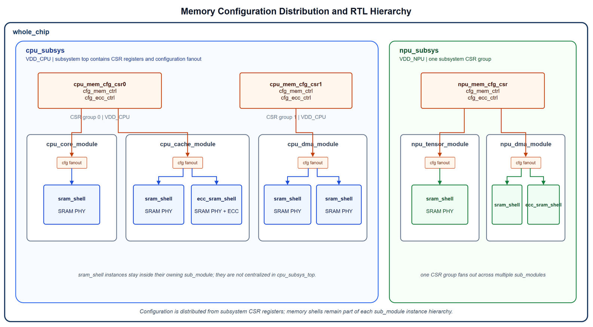
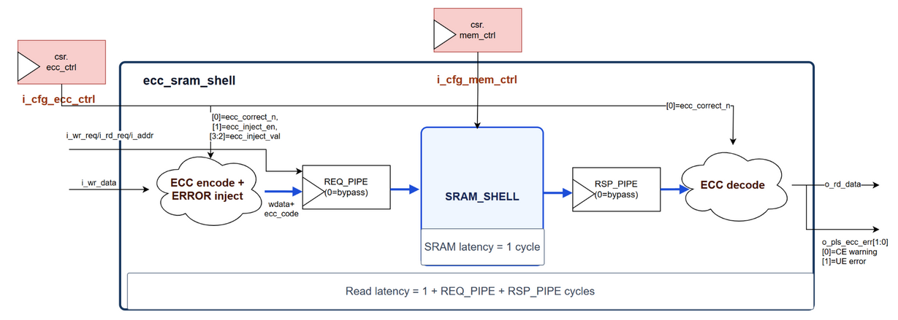

# Memory Tool

## 简介

`mem_tool`用于汇总芯片项目中的SRAM/ROM需求，生成前后端交付使用的Excel，并把后端提供的SRAM PHY wrapper集成到统一memory shell中。

**SRAM前后端交互全流程**

```text
[1] 前端：生成subsystem专属memory shell；cmd: `python3 ./src/main.py -p cpu -m init -w ./build`
[2] 前端：在RTL中例化memory shell
[3] 前端：跑仿真生成*.lst；cmd: `python3 ./src/main.py -p cpu -m sim -w ./build -t top_module -f filelist.f`
[4] 前端：根据*.lst生成memory requirement Excel；cmd: `python3 ./src/main.py -p cpu -m excel -w ./build -x cpu_memory_require.xlsx -cka 1500 -ckb 1000`
[5] 后端：根据Excel生成SRAM PHY及wrapper
[6] 前端：基于PHY wrapper生成集成PHY的shell；cmd: `python3 ./src/main.py -p cpu -m inst -w ./build -x cpu_memory_require.xlsx`
[7] 前端：检查所有memory shape是否已被PHY覆盖，以下方式任选其一
    - 增加`COM_RAM_NFOUND_CHK`宏定义，编译阶段直接拦截未覆盖shape
    - 不加宏定义，仿真后检查*.lst，只允许Info/Message，不允许Warning
```

当前支持`spram`、`tpram1ck`、`tpram2ck`和`sprom`，前三类同时提供ECC shell。生成文件默认放在`mem_tool/build/`。

## 用户指南

### 芯片前端

1. 先根据subsystem名称生成专属shell：`python3 ./src/main.py -p cpu -m init -w ./build`
2. 在项目RTL中例化`cpu_*_shell`或`cpu_ecc_*_shell`，正确配置`DATA_W`、`DEPTH`、`STRB_W`和`MEM_USER`。其中`cpu`是示例`subsys_prefix`，实际项目应替换为对应subsystem名称。
3. 通过项目仿真收集`spram.lst`、`tpram1ck.lst`、`tpram2ck.lst`和`sprom.lst`：`python3 ./src/main.py -p cpu -m sim -w ./build -t top_module -f C:/proj/rtl.f`

`sim`模式会生成`build/sim` sandbox，并把memory shell、model、define复制到sandbox内部。`-f/--filelist`必须使用绝对路径，或使用环境变量加相对路径；后一种写法需用`-e/--sim_env NAME=VALUE`传入环境变量，例如`-f $PROJ_RTL/rtl.f -e PROJ_RTL=C:/proj`。

需要一步式前端流程时，可先生成`all`模式JSON模板再运行：`python3 ./src/main.py --gen_config_json -c ./build/all_config.json`，之后执行`python3 ./src/main.py -c ./build/all_config.json`。`all`模式会依次运行`init/sim/excel/inst`，不包含后端生成SRAM PHY和检查PHY是否齐备这两步。JSON中的`sim_env`使用对象形式，例如`"sim_env": {"PROJ_RTL": "C:/proj"}`；命令行显式传入的参数会覆盖JSON配置。若只想生成sim sandbox，可增加`--sim_no_run`。

只有增加`--sim_no_run`时，filelist格式不合法或文件不存在才会降级为warning并继续生成sandbox，便于检查输出目录；默认`sim`会严格检查filelist，检查通过后依次执行`make com`和`make run`。

4. 生成提交给后端的SRAM需求：`python3 ./src/main.py -p cpu -m excel -w ./build -x cpu_memory_require.xlsx -cka 1500 -ckb 1000`

时钟参数映射：

| Memory类型 | 写时钟       | 读时钟       |
| ---------- | ------------ | ------------ |
| `spram`    | A时钟：`cka` | A时钟：`cka` |
| `tpram1ck` | A时钟：`cka` | A时钟：`cka` |
| `sprom`    | -            | A时钟：`cka` |
| `tpram2ck` | A时钟：`cka` | B时钟：`ckb` |

只有`tpram2ck`需要A/B两个时钟，其余memory的全部访问都使用A时钟。未指定`ckb`时，B时钟频率默认等于`cka`。

5. 后端返回更新后的Excel和PHY wrapper后，生成集成RTL：`python3 ./src/main.py -p cpu -m inst -w ./build -x cpu_memory_require.xlsx`
6. 集成后定义`COM_RAM_NFOUND_CHK`重新编译，确认所有应使用SRAM PHY的memory shape均已匹配。
7. sram_unique要求:
- 不同subsystem必须使用不同的`subsys_prefix`。即使SRAM尺寸相同，也应形成独立的需求和wrapper，避免频率、电压或其他PPA约束不同却误用同一个实现。
- 同一subsystem内，如果相同shape仍有`sram_unique`要求，应设置不同的`MEM_USER`。`MEM_USER=0`表示默认需求，非零值用于手工区分特殊PPA、物理位置、电压频率约束或独立macro实现要求。

### 芯片后端

后端根据Excel中的`prefix`、memory类型、深度、位宽、strobe、频率、实例数量和PPA目标选择memory compiler配置。不同`prefix`属于不同subsystem，不应仅因尺寸相同而合并；同一`prefix`下不同`MEM_USER`也应作为独立需求处理。

后端返回：

1. 保留`subsys_prefix`并更新了`suffix`等wrapper命名信息的Excel。
2. 符合统一端口约定的SRAM PHY wrapper RTL。
3. 仿真model及Liberty、LEF、GDS等实现视图。
4. 无法直接实现的shape所需拆分、拼接或参数调整建议。

### 芯片验证

验证阶段默认使用RTL model完成基础读写、partial write和ECC功能验证；集成PHY wrapper后再次进行编译及读写冒烟检查。签收时应核对Excel shape数量、RTL实例数量和后端macro数量，并开启`COM_RAM_NFOUND_CHK`检查遗漏项。

## RTL集成说明

`com_*`是工具内部通用模板名。项目集成时必须先通过`-p/--subsys_prefix`生成subsystem专属模块，项目RTL只例化`<subsys_prefix>_*`。

### Whole-chip公共文件

以下文件属于whole-chip级公共文件，不应由每个subsystem各自维护一份：

| 文件                 | `com`仓库来源                                         | `mem_tool`内置副本                        |
| -------------------- | ----------------------------------------------------- | ----------------------------------------- |
| `impl_define.sv`     | `com/impl_template/define/impl_define.sv`             | `templates/rtl/define/impl_define.sv`     |
| `impl_define_sim.sv` | `com/impl_template/define/impl_define_sim.sv`         | `templates/rtl/define/impl_define_sim.sv` |
| `com_tpram_reg.sv`   | `com/impl_template/memory/rtl/model/com_tpram_reg.sv` | `templates/rtl/model/com_tpram_reg.sv`    |

`com`仓库继续保留并维护上述文件，`mem_tool`同时携带一份副本，以便脱离`com`独立运行。建立总项目时，可从`com/impl_template`复制，也可从`mem_tool/templates/rtl`复制，但同一项目只能选择一个来源；最终filelist中每个文件只能出现一次，禁止同时编译两个来源的同名文件。实现流程使用`impl_define.sv`，独立仿真流程使用`impl_define_sim.sv`，同一次编译只选择对应配置。

两个仓库之间不建立运行期依赖。公共文件发生修改时，由发布维护者同步更新`mem_tool`内置副本并执行回归；项目使用者仍只选择其中一套文件。

`mem_tool -m sim`生成的sandbox固定使用工具内置副本。集成到whole-chip工程后，公共define和`com_tpram_reg.sv`由项目顶层filelist统一管理，subsystem filelist不再重复加入。

### Shell类型

| 项目生成Shell                    | 对外访问方式             | 说明                         |
| -------------------------------- | ------------------------ | ---------------------------- |
| `<subsys_prefix>_spram_shell`    | 单端口，`ce_n/we_n/addr` | 同一拍只能执行一种访问       |
| `<subsys_prefix>_tpram1ck_shell` | 单时钟独立读写端口       | 读写共享A时钟                |
| `<subsys_prefix>_tpram2ck_shell` | 双时钟独立读写端口       | 写端使用A时钟，读端使用B时钟 |
| `<subsys_prefix>_sprom_shell`    | 单读端口                 | 使用A时钟的物理ROM shell     |
| `<subsys_prefix>_sprom_manual`   | 单读端口                 | 需要人工填写内容的ROM模板    |
| `<subsys_prefix>_ecc_*_shell`    | 对应普通RAM接口          | 在普通shell外增加SECDED保护  |

### 参数说明

| 参数       | 适用Shell | 含义                                                                                                                                                               |
| ---------- | --------- | ------------------------------------------------------------------------------------------------------------------------------------------------------------------ |
| `DATA_W`   | 全部      | 用户可见数据位宽                                                                                                                                                   |
| `DEPTH`    | 全部      | memory entry数量                                                                                                                                                   |
| `STRB_W`   | RAM       | partial write分段数量，要求`DATA_W%STRB_W==0`；每段宽度为`DATA_W/STRB_W`；ECC shell在`STRB_W>1`时，内部`sram_shell`的`STRB_W=DATA_W+ECC_W+1`，等效转换为bit enable |
| `MEM_USER` | 全部      | 同一subsystem内区分相同shape的不同实现需求                                                                                                                         |
| `REQ_PIPE` | ECC RAM   | 请求侧pipeline，范围为0或1；使实际RAM请求延后一拍                                                                                                                  |
| `RSP_PIPE` | ECC RAM   | 返回侧pipeline，范围为0或1；使读数据和错误结果再延后一拍                                                                                                           |
| `ECC_DW`   | ECC RAM   | 单个SECDED分组保护的数据位宽，范围为`[4:DATA_W]`                                                                                                                   |

`ADDR_W=$clog2(DEPTH)`由shell内部计算，不需要集成者配置。

### 普通Shell接口

所有接口均为enable型访问，没有`ready`反压。有效enable在对应时钟上升沿被接受，读数据不附带独立valid，调用方需要按固定读延时自行对齐控制。

`<subsys_prefix>_spram_shell`使用单端口访问：

| 信号                 | 方向   | 含义                                               |
| -------------------- | ------ | -------------------------------------------------- |
| `clk`                | input  | 读写共用A时钟                                      |
| `i_cfg_mem_ctrl`     | input  | SRAM PHY配置，直接透传给wrapper                    |
| `i_ce_n`             | input  | 低有效chip enable；为1时不访问                     |
| `i_we_n[STRB_W-1:0]` | input  | 低有效write enable；全1表示读，存在0表示写对应分段 |
| `i_addr`             | input  | 读写共用地址                                       |
| `i_wr_data`          | input  | 写数据                                             |
| `o_rd_data`          | output | 读返回数据                                         |

`<subsys_prefix>_tpram1ck_shell`使用同一A时钟下的独立读写端口：

| 信号                  | 方向   | 含义                          |
| --------------------- | ------ | ----------------------------- |
| `clk`                 | input  | 读写共用A时钟                 |
| `i_cfg_mem_ctrl`      | input  | SRAM PHY配置                  |
| `i_wr_en[STRB_W-1:0]` | input  | 高有效分段写使能，全0表示不写 |
| `i_wr_addr/i_wr_data` | input  | 写地址和写数据                |
| `i_rd_en`             | input  | 高有效读使能                  |
| `i_rd_addr`           | input  | 读地址                        |
| `o_rd_data`           | output | 读返回数据                    |

`<subsys_prefix>_tpram2ck_shell`与`tpram1ck`的数据接口相同，但写端使用`wr_clk`作为A时钟，读端使用`rd_clk`作为B时钟。只有该类型需要A/B两个时钟。

`<subsys_prefix>_sprom_shell`只有`clk`、`i_cfg_mem_ctrl`、`i_rd_en`、`i_rd_addr`和`o_rd_data`，所有读取均使用A时钟。

读写同地址时的数据行为可能受SRAM compiler配置影响，调用方不能依赖未在PHY wrapper中明确约定的read-first、write-first或no-change行为。

### 配置接口来源



`i_cfg_mem_ctrl`宽度由`COM_MEM_CTRL_W`定义，存在于全部shell中。该信号通常来自subsystem内部的CSR寄存器，再由所属module扇出到本module内例化的各个SRAM/ROM shell；shell不解释其bit含义，只原样连接到SRAM/ROM PHY wrapper。使用RTL model时该信号不参与功能。

SRAM shell应随着业务module例化，不建议为了配置集中管理而全部拉到subsys top。相同subsystem内也可以按电压域、频率域、PPA目标或测试策略拆成多组CSR，例如同一个`cpu_subsys`内用`cpu_mem_cfg_csr0/csr1`分别控制不同一组memory。CSR bit可用于承载工艺相关的retention、低功耗、冗余修复或测试配置，具体定义由后端和芯片集成共同确定。

`i_cfg_ecc_ctrl`宽度由`COM_ECC_CTRL_W`定义，只存在于ECC shell中。该信号与`i_cfg_mem_ctrl`采用相同的CSR来源和扇出方式，用于控制ECC纠错和注错。当前低4bit定义为：

| Bit     | 含义                                                           |
| ------- | -------------------------------------------------------------- |
| `[0]`   | `correct_n`：0开启纠错，1关闭纠错；关闭纠错不等于关闭CE/UE检测 |
| `[1]`   | ECC注错使能，正常工作时应为0                                   |
| `[3:2]` | 注错值，仅在注错使能时使用                                     |

正常功能模式建议连接为`4'b0000`；若宏宽度大于4，其余bit保留并置0。

### ECC错误输出

ECC shell额外输出`o_pls_ecc_err[1:0]`：

| Bit   | 含义                  | 建议处理                                                                     |
| ----- | --------------------- | ---------------------------------------------------------------------------- |
| `[0]` | CE，单bit可纠正错误   | 纠错开启时读数据已修正；外部应累计计数或置sticky状态，达到阈值后上报         |
| `[1]` | UE，多bit不可纠正错误 | 当前读数据不可信；外部应置sticky状态，并按系统要求产生高优先级中断或错误响应 |

`o_pls_ecc_err`是与读返回对齐的脉冲信号，模块内部不保存历史状态，也不提供反压。集成逻辑应在外部增加sticky DFF、计数器或中断汇聚，并保留发生错误的memory来源信息。

ECC读返回及错误脉冲延时为`1+REQ_PIPE+RSP_PIPE`拍。读取`partial_write_flag=1`的row时会绕过ECC检查，因此CE/UE均不产生脉冲。

### Subsystem隔离与MEM_USER

`-p/--subsys_prefix`是SRAM需求的一级隔离维度。它同时进入生成shell名称、Excel的`prefix`字段和PHY wrapper名称。例如CPU与NPU都使用`1024x128`的SRAM时，仍分别生成：

```text
cpu_spram_1024x128_wrapper
npu_spram_1024x128_wrapper
```

两者不能因为尺寸相同而自动合并，因为工作频率、电压、物理区域和PPA目标可能不同。

`MEM_USER`是同一subsystem内部的二级隔离维度。相同`DEPTH/DATA_W/STRB_W`默认共享一项需求；需要不同实现时，为实例设置不同的非零`MEM_USER`。报告和Excel会把它作为独立条件，默认suffix使用`usr<MEM_USER>`。

### RTL model与PHY选择

普通RAM shell使用以下规则：

1. 定义`COM_RAM_AS_REG`时强制使用`com_tpram_reg`。
2. 小memory默认使用寄存器模型；当前判断为`DEPTH<30`或`DATA_W*DEPTH<1024`。
3. 其他memory优先匹配脚本注入的SRAM PHY wrapper。
4. 未命中PHY且未定义`COM_RAM_NFOUND_CHK`时，默认回退到RTL model。
5. 定义`COM_RAM_NFOUND_CHK`后，未命中PHY会故意例化不存在的`*_not_found`模块，使编译失败。

相关宏：

| 宏                   | 作用                                         |
| -------------------- | -------------------------------------------- |
| `COM_RAM_AS_REG`     | 强制RAM使用寄存器模型                        |
| `COM_RAM_AS_BBOX`    | 将shell内部实现视为black box                 |
| `COM_RAM_NFOUND_CHK` | 检查应使用PHY但未匹配的memory                |
| `COM_REPORT_OFF`     | 关闭memory shape报告                         |
| `COM_ECC_USE_RTL`    | 使用自研SECDED RTL；未定义时使用Synopsys实现 |

报告代码由`synopsys translate_off/on`隔离，不参与综合。默认开启报告，定义`COM_REPORT_OFF`后关闭。

### SRAM PHY集成区

每个普通shell包含以下marker：

```systemverilog
// Start of user logic.
// End of user logic.
```

`rtl_gen.py`只替换两个marker之间的内容，为Excel中的每个shape生成条件分支和wrapper instance。分支条件由`DEPTH`、`DATA_W`、`STRB_W`和`MEM_USER`组成。

默认wrapper命名为：

```text
{subsys_prefix}_{mem_type}_{depth}x{width}[x{strb_w}][_{suffix}]_wrapper
```

wrapper端口使用shell内部统一信号：

1. `spram/tpram1ck`：`clk`、写端口、读端口及`i_cfg_mem_ctrl`。
2. `tpram2ck`：独立`wr_clk/rd_clk`、写端口、读端口及`i_cfg_mem_ctrl`。
3. `sprom`：`clk`、读端口及`i_cfg_mem_ctrl`。

同一组条件只能对应一个wrapper；Excel中重复条件会被脚本拒绝。

### ECC实现

ECC shell将`DATA_W`拆分为若干`ECC_DW`分组，每组使用SECDED编码。最后不足一个完整分组时，会单独生成last ECC group。



`REQ_PIPE`位于ECC编码和物理row组包之后、基础RAM shell之前。使能时，请求控制、地址和组包后的写数据经过一级regslice；`REQ_PIPE=0`时直接旁路。

`RSP_PIPE`位于基础RAM shell读数据输出之后、物理row拆包和ECC解码之前。使能时，读回的完整物理row经过一级regslice；`RSP_PIPE=0`时直接旁路。基础RAM同步读固定占用一拍，因此读数据及`o_pls_ecc_err`的有效延时为`1 + REQ_PIPE + RSP_PIPE`拍。

物理RAM row布局为：

```text
{partial_write_flag, last_ecc, normal_ecc[], original_data}
```

主要行为：

1. Full write更新全部原始数据和ECC位，并清除`partial_write_flag`。
2. Partial write只更新命中的原始数据bit，并置位`partial_write_flag`。
3. 读取到`partial_write_flag=1`的row时直接返回原始数据，不进行ECC纠错，同时屏蔽CE/UE报告。
4. ECC物理RAM使用bit write enable，确保任意partial write都能独立更新数据和最高位flag。

### ROM人工维护

生成`<subsys_prefix>_sprom_manual.sv`后，设计者需要在`USER_EDIT_REQUIRED`区域填写ROM数据。该文件只在不存在时生成，后续执行`init/inst`不会覆盖人工修改。

## 脚本开发者

### Python模块

| 文件                  | 职责                                |
| --------------------- | ----------------------------------- |
| `main.py`             | 主入口和工作模式调度                |
| `config.py`           | CLI参数解析与校验                   |
| `model.py`            | `MemoryShape`数据模型和公共校验     |
| `report.py`           | `.lst`解析、去重和实例聚合          |
| `excel_io.py`         | Excel生成与读取                     |
| `rtl_gen.py`          | 模块改名、PHY instance生成和RTL输出 |
| `get_rtl_template.py` | 从原始shell生成Python模板           |
| `rtl_template.py`     | 自动生成的RTL字符串字典             |
| `gen_sram_excel.py`   | 旧命令兼容入口                      |

### RTL模板同步

修改`rtl/shell/*.sv`后执行：

```bash
python3 ./src/get_rtl_template.py
```

该命令抓取全部shell并重新生成`src/rtl_template.py`。提交前可检查是否同步：

```bash
python3 ./src/get_rtl_template.py --check
```

运行`mem_tool`时，`rtl_gen.py`只读取`rtl_template.py`，不再访问原始`rtl/shell`目录。因此修改shell后必须同步模板。

### 新增或修改Shell

1. 在`mem_tool/rtl/shell`中完成并检查原始RTL。
2. 保留唯一的PHY插入marker和fallback分支。
3. 更新必要的宏定义和仿真模板。
4. 执行`get_rtl_template.py`同步Python模板。
5. 更新`rtl_gen.py`中的端口映射或memory类型列表。
6. 增加对应单元测试并执行完整生成流程。

### 工作模式

| Mode    | 输入                 | 输出                            |
| ------- | -------------------- | ------------------------------- |
| `init`  | `rtl_template.py`    | 不含PHY instance的子系统shell   |
| `excel` | `build/*.lst`        | memory requirement Excel        |
| `inst`  | Excel或`*.lst`       | 已注入PHY instance的子系统shell |
| `sim`   | top module和filelist | `build/sim`仿真sandbox及`*.lst` |
| `all`   | top module和filelist | 依次执行`init/sim/excel/inst`   |

配置可通过CLI指定，也可通过`-c/--config_json`读取JSON。`-w/--work_path`指定输入和输出目录；`-x/--excel_name`只接受文件名，文件位于work path下。`sim`模式使用`-t/--top_module`指定顶层模块，使用`-f/--filelist`指定项目filelist，使用`-e/--sim_env`补充filelist中引用的环境变量。

生成JSON模板时，`--gen_config_json`默认生成`all`配置；也可指定`init/excel/inst/sim/all`，例如：`python3 ./src/main.py --gen_config_json excel -c ./build/excel_config.json`。

各模式最少配置项：

```json
{"mode": "init", "subsys_prefix": "cpu", "work_path": "./build"}
```

```json
{
    "mode": "excel",
    "subsys_prefix": "cpu",
    "work_path": "./build",
    "excel_name": "cpu_memory_require.xlsx",
    "clk_a": 1500,
    "clk_b": 1000
}
```

```json
{
    "mode": "inst",
    "subsys_prefix": "cpu",
    "work_path": "./build",
    "excel_name": "cpu_memory_require.xlsx"
}
```

```json
{
    "mode": "sim",
    "subsys_prefix": "cpu",
    "work_path": "./build",
    "top_module": "top_module",
    "filelist": "$PROJ_RTL/rtl.f",
    "sim_env": {"PROJ_RTL": "C:/proj"}
}
```

```json
{
    "mode": "all",
    "subsys_prefix": "cpu",
    "work_path": "./build",
    "excel_name": "cpu_memory_require.xlsx",
    "clk_a": 1500,
    "clk_b": 1000,
    "top_module": "top_module",
    "filelist": "$PROJ_RTL/rtl.f",
    "sim_env": {"PROJ_RTL": "C:/proj"}
}
```

### MemoryShape

`MemoryShape`使用`dataclass`统一保存和校验：

```text
mem_type, prefix, suffix, depth, width, strb_w, mem_user,
instance_num, hierarchy, wr_clk_mhz, rd_clk_mhz, ppa_target
```

主要约束：

1. `mem_type`必须属于支持列表。
2. `prefix/suffix`必须是合法SystemVerilog标识符。
3. `depth/width/strb_w`必须为正整数。
4. `width`必须可被`strb_w`整除。
5. `sprom`不支持write strobe。

### Report与Excel

`.lst`解析采用严格格式，非法非空行会报告文件名和行号。相同shape会聚合实例数量和hierarchy。

Excel使用固定sheet名`memory_list`，按表头名称读取，因此允许调整列顺序。主要字段包括：

```text
mem_type, prefix, suffix, depth, width, strb_w, mem_user,
wr_clk_MHz, rd_clk_MHz, ppa_target, instance_num,
capacity_KiB, hierarchy
```

Excel 层级字段统一使用 `hierarchy`，填写实例层级路径。

### RTL生成安全性

1. PHY插入marker必须各出现一次且顺序正确，否则立即报错。
2. RTL输出先写同目录临时文件，再原子替换目标文件。
3. 文件内容不变时不重复写入。
4. `*_sprom_manual.sv`存在时禁止覆盖。
5. 空memory类型保留`if(0)`哨兵，保证后续fallback `else`语法完整。
6. Excel中相同条件重复时拒绝生成，避免不可达的`else if`。

### 配置与错误处理

查看全部CLI参数：

```bash
python3 ./src/main.py --help
```

非法mode、缺失Excel、非法频率、错误report格式、非法sim filelist和模板不同步均应明确失败。

`gen_sram_excel.py`仅用于兼容旧命令，实际功能由`main.py`及其他模块实现。

### 测试

```bash
python3 -m unittest discover -s tests -v
python3 ./src/get_rtl_template.py --check
```

当前测试覆盖：

1. RTL源文件与`rtl_template.py`同步。
2. `.lst`解析、shape聚合和错误行定位。
3. Excel末行读取和重复条件检查。
4. ROM manual文件保护。
5. RTL重复生成幂等性。
6. 空memory类型fallback。
7. `COM_RAM_NFOUND_CHK`默认及严格模式语义。
8. CLI参数解析与默认值。

新增解析规则、Excel字段、memory类型或RTL生成行为时，应同步增加fixture和回归测试。
