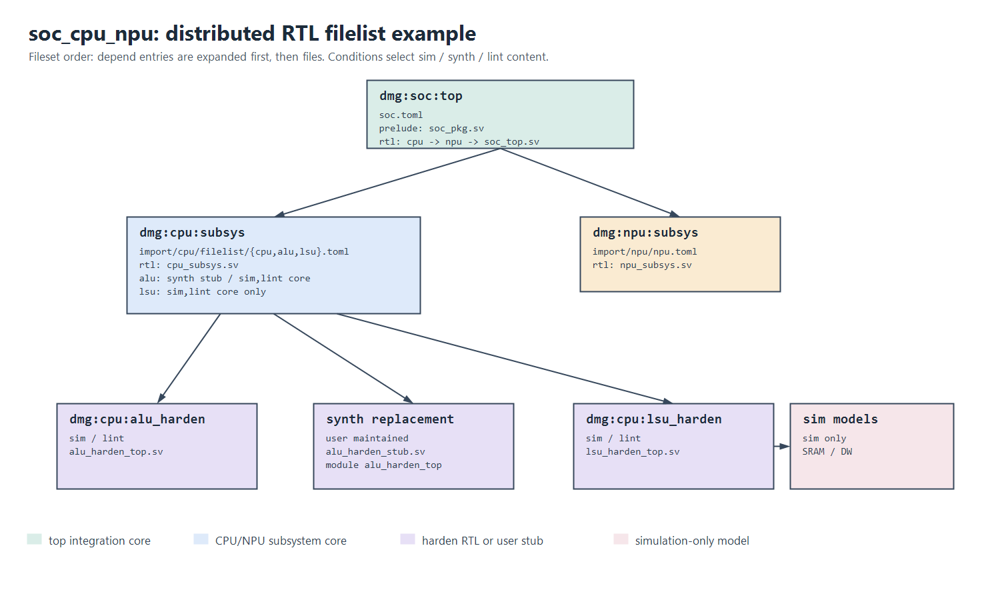

# rtl_flist_mgr

`rtl_flist_mgr` 在已同步的多 Git workspace 中扫描 RTL core TOML 或 legacy FuseSoC `.core`，递归展开有序依赖并生成传统 `.f` filelist。它只负责 filelist：不 clone 仓库、不编译 RTL、不生成 stub、不解析 module。

## 快速使用

```bash
python -B src/rtl_flist_mgr.py rtl/soc.toml -o out/soc_sim.f
python -B src/rtl_flist_mgr.py rtl/soc.toml -m synth -o out/soc_synth.f
python -B src/rtl_flist_mgr.py rtl/soc.toml -m lint -o out/soc_lint.f
python -B src/rtl_flist_mgr.py --list-core
```

`sim` 是默认模式。工具直接扫描 workspace 根目录（排除 `import/`）和 `import/*/` 的一级 checkout，并更新 `.rtl_flist/core_index.toml`、`.rtl_flist/core_tree.txt`。`git_repo_mgr` 可选用于将多仓库平铺同步到 `import/`，但不是运行依赖。

## Core TOML

```toml
[core]
id = "dmg:cpu:subsys"
filesets = ["rtl", "alu", "!is_synth ? (lsu)"]

[fileset.rtl]
dir = "."
files = ["cpu_subsys.sv"]

[fileset.alu]
dir = "."
files = ["is_synth ? (alu_harden_stub.sv)"]
depend = ["!is_synth ? (dmg:cpu:alu_harden)"]

[fileset.lsu]
depend = ["dmg:cpu:lsu_harden"]
```

| element            | purpose |
| ------------------ | ------- |
| `[core]`           | `id` 是稳定 core 标识；`filesets` 是唯一的 fileset 展开顺序来源。省略时按声明顺序展开全部 fileset。 |
| `[fileset.<name>]` | 一个有序文件集合，可放 `depend`、`files`、`dir`、`include_dirs`、`defines`、`legacy_f`、`file_type`。 |
| `depend`           | 有序 core ID 数组。当前 fileset 先递归展开其 `depend`，再输出自己的 `files`。 |
| `files`            | 有序文件数组；文件相对 `dir`，未填 `dir` 时相对 TOML 所在目录。 |
| `dir`              | 相对所属 Git root，适合将多个 core TOML 集中到 `filelist/` 而 RTL 保持原目录。 |

同一个 core 或文件被多处引用时，只在第一次出现的位置展开/输出；依赖环、重复 `core_id`、缺失文件和路径逃出 Git root 都会报错。

## Flag 与模式

条件写作 `condition ? (value)`，支持 `!`、`&&`、`||`。工具内建互斥 flag：`is_sim`、`is_synth`、`is_lint`。条件可作用于文件、fileset 选择项和 `depend` 中的 core ID 引用。

```toml
[core]
filesets = ["rtl", "!is_synth ? (lsu)"]

[fileset.alu]
files = ["is_synth ? (alu_harden_stub.sv)"]
depend = ["!is_synth ? (dmg:cpu:alu_harden)"]
```

| mode    | active flag | typical use |
| ------- | ----------- | ----------- |
| `sim`   | `is_sim`    | 展开 RTL、testbench 和仿真模型。 |
| `synth` | `is_synth`  | 选择用户维护的 stub，或跳过已 harden 的内部 RTL。 |
| `lint`  | `is_lint`   | 保留待检查 RTL，同时按条件排除 SRAM/DW 仿真模型。 |

## 用户维护 Stub

综合替代实现由用户作为普通 fileset 文件维护。例如原模块为 `abc`、原文件为 `abc.sv` 时，`abc_stub.sv` 或 `abc_bbox.sv` 仍必须只定义 `module abc`，以供后端综合链接原实例。`_stub`/`_bbox` 是文件形态标识，也是 `filename = module_name` 规则的唯一例外。

## 集中管理 Core TOML

TOML 可放在仓库任意位置。推荐在复杂子系统中集中到 `<repo>/filelist/`，让 RTL、模型和 wrapper 保持原目录，使用 fileset 的 `dir` 指向 Git root 下的实际位置：

```text
cpu/
├── filelist/
│   ├── cpu.toml
│   ├── alu.toml
│   └── lsu.toml
├── cpu_subsys.sv
├── alu/
│   └── alu_harden_top.sv
└── lsu/
    ├── lsu_harden_top.sv
    └── model/
```

这种组织是新 TOML 相比 legacy `.core` 的实用优势：core 描述可统一审阅、统一生成/检查，RTL 目录不因 filelist 组织被迫调整。

## 路径与 Legacy 兼容

默认 `--path-style absolute`，适合后端、DW/SRAM 等绝对模型目录；也可选择 `relative` 或 `rootvar`。

`legacy_f` 可在 TOML fileset 中封装旧 `.f`，支持普通文件、`-f` / `-F`、`+incdir+`、`+define+`。外部目录由 `--var NAME=VALUE` 显式传入；未支持的 legacy 选项会报错。常见 FuseSoC CAPI2 `.core`、fileset `depend` 与 `targets.default` 也保持兼容。

## 参数

| parameter             | description |
| --------------------- | ----------- |
| `core_file`           | 顶层 core TOML 或 `.core`；生成 flist 时必填。 |
| `-o <output.f>`       | 生成的 filelist；生成 flist 时必填。 |
| `-m <sim|synth|lint>` | 输出模式，默认 `sim`。 |
| `-w <workspace>`      | workspace 根目录；`import/*/` 自动视为独立 checkout root，默认当前目录。 |
| `--path-style`        | `absolute`、`relative` 或 `rootvar`，默认 `absolute`。 |
| `--var NAME=VALUE`    | `legacy_f` 外部路径变量，可重复指定。 |
| `--list-core`         | 仅列出 `import/` 外的本体 core。 |

## 固定示例与回归

`test/examples/soc_cpu_npu/` 提供 `soc -> cpu/npu` 的完整小型 workspace：CPU 的 core TOML 集中到 `import/cpu/filelist/`，同时覆盖依赖顺序、file/fileset/core-ID 条件、用户维护 stub 与仿真模型。



```bash
python -B test/test_rtl_flist_mgr.py
```

## 文档约定

Markdown 表格必须在源码中按列宽补齐空格并对齐 `|`，保证渲染前后的可读性。
